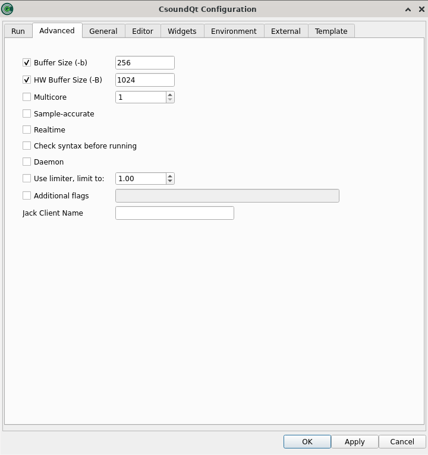

# The *Advanced* Tab   

   

The first two options are important for live settings as the latency mostly depends on them.

### Buffer Size (-b) 

This defines the software buffer size in samples (corresponding with the -b flag).

If you do not tick, CsoundQt will use the defaults. According to the [Csound Manual](https://csound.com/docs/manual/CommandFlags.html) these are 256 samples on Linux, 1024 on MacOS X, and 4096 on Windows.

If you tick to enter an own value, these are some hints:   
- Always use power-of-two values.  
- Usually the [ksmps](http://csound.github.io/docs/manual/ksmps.html) block size is 1/4 or 1/2 of the software buffer size. If you use live input and output, it is most effective to set the software buffer size to an integer multiple of *ksmps* ("full duplex audio").  
- Use smaller values (e.g. 128) for live performance (in particular with live input), as it will reduce the latency. Use larger values (e.g. 1024) for other cases, for instance playing sound files.   

### HW Buffer Size (-B)

This defines the hardware buffer size in samples (corresponding with the -B flag).   

If you do not tick, CsoundQt will use the defaults. According to the [Csound Manual](https://csound.com/docs/manual/CommandFlags.html) these are 1024 samples on Linux, 4096 on Mac OS X and 16384 on Windows.

If you tick to enter an own value, these are some hints:   
- Always use a multiple integer of the software buffer size. A common relation is: Hardware Buffer Size = 4 * Software Buffer Size.   
- The relation between software buffer size and hardware buffer size depends on the audio module.[1]

### Multicore

You can try to set this to a number larger than one in case you hit the performance limit in real-time computing. It may or may not help. This is very much depending on your code.

### Sample-accurate

Enable sample-accurate mode. In this mode rendering is not quantized to performance cycles but starts at the specified sample corresponding to the start time of an event.

### Realtime

Realtime priority mode. In this mode all initialization (loading of buffers, etc) is done in a background thread. The scheduled instrument starts executing when these background tasks are finished. This can help to eliminate dropouts (but might have a negative effect in scheduling accuracy). **NB: in realtime mode all printing is done to stderr.** In order to see the effect of any printing opcodes open CsoundQt from the command line. All printing will be visible at the terminal.

### Check syntax before running

In some cases csound might crash (and CsoundQt might crash with it) before any debugging information is visible in the CsoundQt console (during compilation). For such cases turn on this option to do a syntax check prior to running csound with full communication with widgets, etc.

### Daemon

Do not exit if CSD/orchestra is not given, is empty or does not compile.  
**NB**: use with care. In the case of syntax errors csound will keep execution in at times undefined state, causing crashes and possibly bringing CsoundQt down with it.  
**NB2**: in the absence of a score or of any events within the *CsScore* tag csound goes into daemon mode by default.

### Use limiter / Additional flags / jack Client Name

These options should be self explanatory.

______________

[1]  In the explanation of Victor Lazzarini (Email to Joachim Heintz, 19 march 2013):   
    1. For portaudio, -B is only used to suggest a latency to the backend, whereas -b is used to set the actual buffersize.   
    2. For coreaudio, -B is used as the size of the internal circular buffer, and -b is used for the actual IO buffer size.   
    3. For jack, -B  is used to determine the number of buffers used in conjunction with -b  , num = (N + M + 1) / M. -b is the size of each buffer.   
    4. For alsa, -B is the size of the buffer size, -b is the period size (a buffer is divided into periods).   
    5. For pulse, -b is the actual buffersize passed to the device, -B is not used.   
    In other words, -B is not too significant in 1), not used in 5), but has a part to play in 2), 3) and 4), which is functionally similar.

