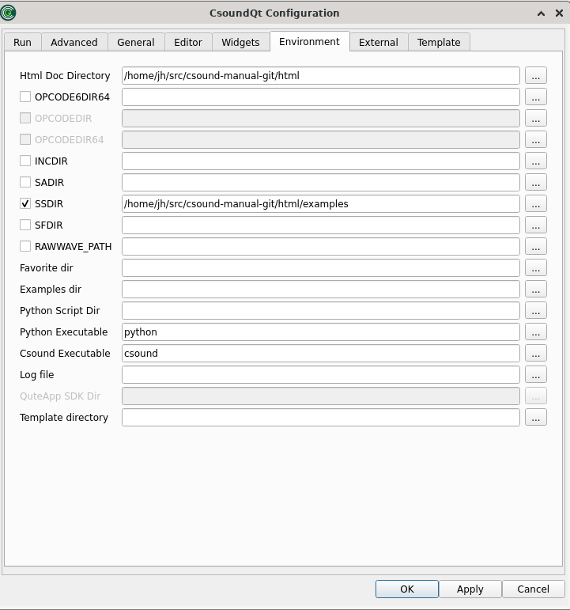

# The *Environment* Tab

There are some important settings here, along with some only for developers. We will focus on the options which can be important for all users. 

**Html doc directory** 

> This refers to the folder containing the Canonical Csound Manual. If you choose View -> Help Panel, and see nothing but a message like "not found!", you will have to set here the directory for the manual. Click on the browse button on the right side, and choose the folder where it is on your computer.    
 

**SADIR** (Sound Analysis Directory) 

> You can set here the directory in which Csound will seek for analysis files like .pvx files.   
 

**SSDIR** (Sound Sample Directory) 

> This is very useful to set a folder for sound samples, for instance used by [diskin](http://csound.github.io/docs/manual/diskin.html). You can then refer to the sample only by name.   
 

**SFDIR** (Sound File Directory) 

> To specify a directory for output files. This is usually be done in the 'Run' tab, as explained above (Output Filename).   
 

**INCDIR** (Include Directory) 

> Specifies a directory for files which all called by the [#include](http://csound.github.io/docs/manual/include.html) statement.   
 

**Favorite dir** 

> Specifies a directory which will then appear under the menu as 'Favorites'.   
 

**Python script dir** 

> Usually you will leave this empty so that CsoundQt links to the Python Scripts it comes with. Only specify if you build CsoundQt or want to change the scipts folder.   
