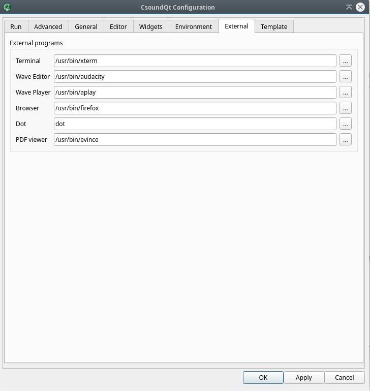

# The *External* Tab 

Should be self-explanatory. 'Dot' is the executable from [www.graphviz.org.](https://graphviz.org/) It is used in CsoundQt for the Code Graph Viewer (*View > View Code Graph*).  
 	
