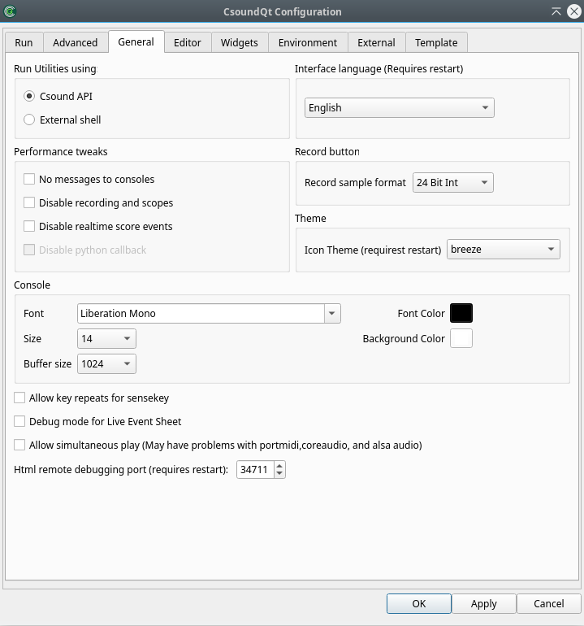

# The *General* Tab

   
 

#### **Run Utilities using:**

This should be self-explanatory and is only meaningful if you run any of the Csound Utilities like [sndinfo](http://csound.github.io/docs/manual/UtilityQueries.html) or the FFT analysis tool [pvanal](http://csound.github.io/docs/manual/pvanal.html). 

#### **Interface language**

Self-explanatory. 

#### **Performance tweaks**

These are very important options in case you use CsoundQt for real-time usage and experience performance problems.   

**No messages to consoles** 

> Tick this to disable any printout.   
 

**Disable recording and scopes** 

> This refers to CsoundQt's internal Record facility and to the Scope widget.   
 

**Disable realtime score events** 

> If you check this, you will not be able to send any live score event, for instance from a Button widget or the Live Event Sheet.   
 

**Disable python callback** 

> If you do not use CsoundQt's internal Python scripting facility in real-time, you should check this to improve the overall performance.   
 

#### **Internal MIDI interface**

The "Internal MIDI interface" is the MIDI device from which MIDI control messages are sent directly to the CsoundQt widgets. Have a look, for instance, in the properties of a Slider widget to see the MIDI CC number and the MIDI Channel to be specified.    
Note that this does *not* set the input MIDI device for Csound itself (which has be explained above in Run -> RT MIDI Module -> Input device).   

#### **Record sample format**

Defines the bit depth of the audio file to which CsoundQt records its real-time output, when using the Record button (or the 'record' option from the Control menu). For most cases 32bit float or 24bit formats are recommended. The former is particularly useful as it can hold ‘clipped‘ sample values, which can be later normalised. 

#### **Console**

You can choose here how the Csound output console looks like. 

**Control message buffer size** 

> If you do not not want to prevent CsoundQt from printing anything to the console at all (see above) but want to reduce this output for performance's sake, you can set here a limit.   
 

There are some mixed options at the bottom of this tab: 

**Allow key repeats for sensekey** 

> If you press a key on your computer for a long time, the key is repeated. This may or may not be useful for the [sensekey](http://csound.github.io/docs/manual/sensekey.html) opcode and can be decided here.   
 

**Debug mode for Live Event Sheet** 

> Self-explanatory.   
 

**Allow simultaneous play** 

> If checked, it allows you to play more than one csd tab simultansously.   
 

**Theme** 

> Allows you to choose between the traditional ("fun") CsoundQt look, and a more serious ("boring") one.   

