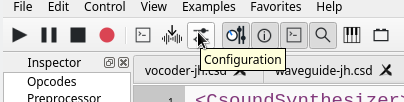

# CsoundQt Configuration

CsoundQt gives easy access to the most important [Csound options](http://csound.github.io/docs/manual/CommandFlags.html) and to many specific CsoundQt settings via its Configuration Panel. In particular the *Run* tab offers many choices which have to be understood and set carefully. 

To open the configuration panel simply push the 'Configure' button, or go to Configuration/Preferences in the File menu. The configuration panel comprises eight tabs. The available configurable parameters in each tab are described below for each tab.

