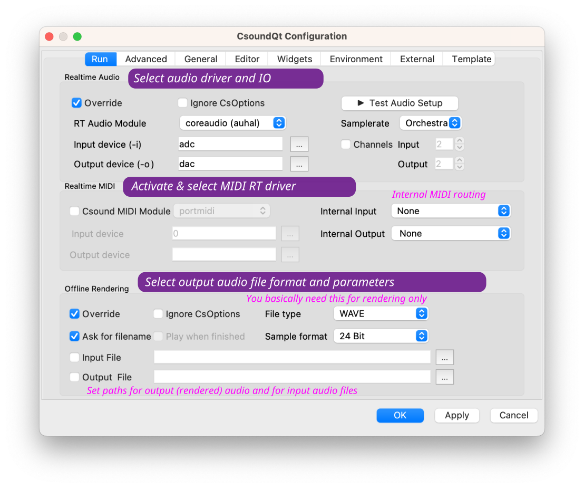
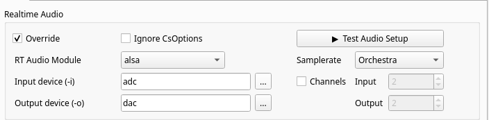
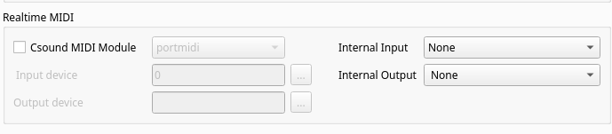
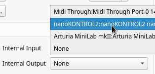
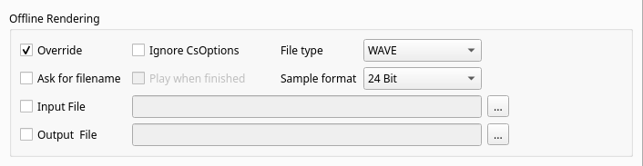

# The *Run* Tab

   

The settings at the top of the “Run” tab allow the user to define the command-line flags with which Csound is invoked. 

## Realtime Audio

These options determine CsoundQt's behaviour if you push the *Run* button (or select the menu item Control -> Run Csound). 

### Basic Settings

In the left half we find all basic settings for dealing with real-time audio.

#### Override

Tick this to activate the CsoundQt options configured here. 
 
#### Ignore CsOptions 

Use this to ignore the option embedded in the  section of the csd files you are running.

**NOTE** that care must be taken to avoid inconsistencies between CsOptions and CsoundQt options. For beginners, it is recommended to disable CsOptions when the CsoundQT options are enabled. If you are a more experienced user, you can leave this unchecked to allow some additional options like -m128 to reduce Csound's printout.

**NOTE** that if you have checked* *"Use CsoundQt options" and have *not* checked "Ignore CsOptions", in the case of a conflict between both the CsoundQt options set in the configure panel will have the priority.   
 
#### RT Audio Module

This option is very much dependent on your operating system.   

In case you experience crashes or have problems with the real time performance, it is worth to try another module.   

The most common choices on the different operating systems are probably:   
- For Linux, use alsa or jack.   
- For OSX, use coreaudio or portaudio.   
- For Windows, use portaudio.

#### Input device 

This option selects the device you are using for real-time input, for instance from a microphone. (Note that you must have ticked "Use CsoundQt options" if you want Csound to use your selection.)

The usual (and most stable) choice here is *adc*. In this case Csound will use the device which has been selected as standard by your operating system.

If you want to use another device instead, click on the button at the right side. You will find a list of available devices and can choose one of them.

If you don't have realtime input, choose "no input".

**NOTE**: The portaudio module usually requires the same number of input and output channels. Some computers have 2 output channels but a microphone with only 1 input channel. In this case you will get the error: `*** PortAudio: error: -9998: Invalid number of channels`. Use `nchnls_i = 1` in your csd header in this case, or if you have no live input, set the *Input device (-i)* field to "No input".
 

#### Output device 

This option selects the device you are using for real-time output. (Note that you must have ticked "Use CsoundQt options" if you want Csound to use your selection.)

The usual (and most stable) choice here is *dac*. In this case Csound will use the device which has been selected as standard by your operating system.

If you want to use another device instead, click on the button at the right side. You will find a list of available devices and can choose one of them. 

### Test Audio

In the right half we find direct access to a built-in audio test and some additional possibilities.

#### Samplerate

Usually Csound will use the sample rate which is set in the .csd file as the [sr](https://csound.com/docs/manual/sr.html) statement. In case you prefer other options, you can set here to use the system sample rate or some standard sizes.

#### Channels

Usually Csound will use the number of channels which is set in the .csd file as the [nchnls](https://csound.com/docs/manual/nchnls.html) statement. In case you prefer other options, you can set here the number of input and output channels.

## Realtime MIDI 

### Csound MIDI Module

Left hand side you choose whether you use the internal Csound MIDI handler, or CsoundQt's own MIDI handler.

In general you will **not** check this box because you will want to use CsoundQt's own MIDI handler (which is [RtMidi](https://github.com/thestk/rtmidi/tree/master)).

If you choose to use Csound's internal MIDI module instead, you will not be able to use the built-in connection between MIDI devices and CsoundQt widgets.

 
### Internal Input 

If you opt for CsoundQt's internal MIDI handler (by NOT checking the *Csund MIDI Module* box), you select here the MIDI device to be used by CsoundQt.

**Note** that you can NOT chosse more than one device here. If you want to use two or more MIDI devices, you must merge them via hardware or software.
 

### Internal Output 

This is only when you **send** MIDI to an external device. 

## Offline Rendering

These options determine CsoundQt's behaviour if you render to file (by pushing the *Render* button or selecting the menu item *Control > Render to file*). 

### Override 

Tick this to activate the CsoundQt options configured here. 
 

### Ignore CsOptions 

Use this to ignore the option embedded in the  section of the csd files you are rendering.

**NOTE** that care must be taken to avoid inconsistencies between CsOptions and CsoundQt options. For beginners, it is recommended to tick "Ignore CsOptions" when the CsoundQT options are enabled. If you are a more experienced user, you can leave this unchecked to allow some additional options like -m128 to reduce Csound's printout.

**NOTE** that if you have *checked* "Use CsoundQt options" and have *not* checked "Ignore CsOptions", in the case of a conflict between both the CsoundQt options set in the configure panel will have the priority.   

### Ask for filename

Ask for a filename to render the performance to. For beginners it is recommended to activate it. Otherwise it may happen that you acidentally overwrite an already existing file.
 

### File type / Sample format

Use this to set the output file format. 
 

### Input Filename 

Corresponds with the -i flag (Input soundfile name).  
 

### Output Filename 

Corresponds with the -o flag for defining the output file name to which the sound is written. 
 

   
