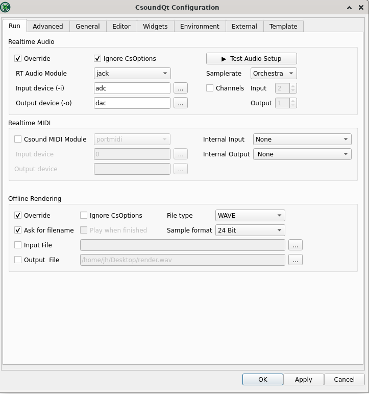

CsoundQt gives easy access to the most important [Csound options](http://csound.github.io/docs/manual/CommandFlags.html) and to many specific CsoundQt settings via its Configuration Panel. In particular the 'Run' tab offers many choices which have to be understood and set carefully. 

To open the configuration panel simply push the 'Configure' button. The configuration panel comprises seven tabs. The available configurable parameters in each tab are described below for each tab.

# The *Run* Tab

   

The settings at the top of the “Run” tab allow the user to define the command-line flags with which Csound is invoked. 

## Realtime Audio

## Realtime MIDI

## Offline Rendering

**Buffer Size (-b)** 

> This defines the software buffer size (corresponding with the -b flag).   
> If you do not tick, CsoundQt will use the defaults.[1]    
> If you tick to enter an own value, these are some hints:   
>     - Always use power-of-two values.  
>     - Usually the [ksmps](http://csound.github.io/docs/manual/ksmps.html) block size is 1/4 or 1/2 of the software buffer size. If you use live input and output, it is most effective to set the software buffer size to an integer multiple of *ksmps* ("full duplex audio").  
>     - Use smaller values (e.g. 128) for live# Run performance (in particular with live input), as it will reduce the latency. Use larger values (e.g. 1024) for other cases, for instance playing sound files.   

**HW Buffer Size (-B)** 

> This defines the hardware buffer size (corresponding with the -B flag).   
> If you do not tick, CsoundQt will use the defaults.[2]    
> If you tick to enter an own value, these are some hints:   
>     - Always use a multiple integer of the software buffer size. A common relation is: Hardware Buffer Size = 4 * Software Buffer Size.   
>     - The relation between software buffer size and hardware buffer size depends on the audio module.[3]   

**Use new parser** 

> This option has been introduced during the transition between the old and the new parser (which was between Csound 5.13 and 5.14), and is now obsolete.   

**Use multicore /Number of threads** 

> This option is only available when the new parser is enabled, and corresponds with the -j flag. For instance, ‘-j 2‘ will tell Csound to use 2 parallel processors when possible.   
> You should use this option with care. It may be also worth to state that using multiple threads will not in each case improve the performance. Whether it does or not depends on the structure of the csd file you run.   

**Dither** 

> Switches on dithering (the --dither flag) for the conversion of audio from the internal resolution (now mostly 64 bit double precision float) to the output sample format (see below).    

**Additional command line flags** 

> This enables the user to add any additional [options](http://csound.github.io/docs/manual/CommandFlags.html) not listed here. Only use if you know what you are doing!  

#### **File (offline render)**

These options determine CsoundQt's behaviour if you render to file (by pushing the *Render* button or selecting the menu item Control -> Render to file). 

**Use CsoundQt options** 

> Tick this to activate the CsoundQT options configured here. 
 

**Ignore CsOptions** 

> Use this to ignore the option embedded in the  section of the csd files you are rendering.   
> NOTE that care must be taken to avoid inconsistencies between CsOptions and CsoundQt options. For beginners, it is recommended to tick "Ignore CsOptions" when the CsoundQT options are enabled. If you are a more experienced user, you can leave this unchecked to allow some additional options like -m128 to reduce Csound's printout.   
> NOTE that if you have *checked* "Use CsoundQt options" and have *not* checked "Ignore CsOptions", in the case of a conflict between both the CsoundQt options set in the configure panel will have the priority.   

**Ask for filename every time** 

> Ask for a filename to render the performance to. 
 

**File type / Sample format** 

> Use this to set the output file format. 
 

**Input Filename** 

> Corresponds with the -i flag (Input soundfile name).  
 

**Output Filename** 

> Corresponds with the -o flag for defining the output file name to which the sound is written.   
 

   
 
#### **Realtime Play**

These options determine CsoundQt's behaviour if you push the *Run* button (or select the menu item Control -> Run Csound). 

**Use CsoundQt options** 

> Tick this to activate the CsoundQT options configured here. 
 

**Ignore CsOptions** 

> Use this to ignore the option embedded in the  section of the csd files you are running.   
> NOTE that care must be taken to avoid inconsistencies between CsOptions and CsoundQt options. For beginners, it is recommended to disable CsOptions when the CsoundQT options are enabled. If you are a more experienced user, you can leave this unchecked to allow some additional options like -m128 to reduce Csound's printout.   
> NOTE that if you have checked* *"Use CsoundQt options" and have *not* checked "Ignore CsOptions", in the case of a conflict between both the CsoundQt options set in the configure panel will have the priority.   
 

**RT Audio Module** 

> This option is very much dependent on your operating system.   
> In case you experience crashes or have problems with the real time performance, it is worth to try another module.   
> The most common choices on the different operating systems are probably:   
>     - For Linux, use alsa or jack.   
>     - For OSX, use coreaudio or portaudio.   
>     - For Windows, use portaudio.

**Input device** 

> This option selects the device you are using for real-time input, for instance from a microphone. (Note that you must have ticked "Use CsoundQt options" if you want Csound to use your selection.)   
> The usual (and most stable) choice here is *adc*. In this case Csound will use the device which has been selected as standard by your operating system.   
> If you want to use another device instead, click on the button at the right side. You will find a list of available devices and can choose one of them.  
> If you don't have realtime input, choose "no input".  
> NOTE: The portaudio module usually requires the same number of input and output channels. Some computers have 2 output channels but a microphone with only 1 input channel. In this case you will get the error: `*** PortAudio: error: -9998: Invalid number of channels`. Use `nchnls_i = 1` in your csd header in this case.
 

**Output device** 

> This option selects the device you are using for real-time output. (Note that you must have ticked "Use CsoundQt options" if you want Csound to use your selection.)   
> The usual (and most stable) choice here is *dac*. In this case Csound will use the device which has been selected as standard by your operating system.   
> If you want to use another device instead, click on the button at the right side. You will find a list of available devices and can choose one of them. 
 

**RT MIDI Module** 

> This option is very much dependent on your operating system.   
> In case you experience problems with MIDI, it is worth to try another module. In case you do not use any MIDI at all, select *none* to get rid of one possible source of trouble.   
> The most common choices on the different operating systems are probably:   
>     - For Linux, use alsa or portmidi.   
>     - For OSX, use coremidi or portmidi.   
>     - For Windows, use portmidi.

 
**Input device** 

> This option selects the device you are using for real-time MIDI input. (Note that you must have ticked "Use CsoundQt options" if you want Csound to use your selection.)   
> The usual choice here is *a*. In this case Csound will use all MIDI devices.   
> In case your RT MIDI Module does not support this option, click on the button at the right side. You will find a list of available devices and can choose one of them. 
 

**Output device** 

> This option selects the device you are using for real-time MIDI output. (Note that you must have ticked "Use CsoundQt options" if you want Csound to use your selection.)   
 

**Jack client name** 

> This option specifies the name for communicating with a Jack audio client. The default '*' means 'all' clients.   

