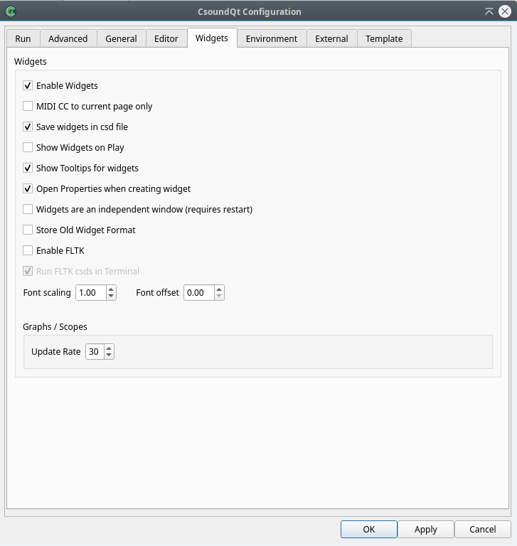

# The *Widgets* Tab

 

**Enable Widgets** 

> If not checked, you cannot use any of CsoundQt's widgets.   
 

**Save Widgets in csd file** 

> Each csd file has a section for widgets and presets. These sections are hidden when you open your csd file in CsoundQt, but are visible in any text editor. So if you do not have checked this option, you will not see any of your widgets the next time you open your csd. So, only useful if you want to export a csd without the widget tags.   
 

**Show Widgets on play** 

> If checked, the widget panel will pop up each time you push the Play button.   

**Show tooltips for widgets** 

> Enables a useful feature which lets you see the channel name of a widget if you stay a moment on it with the computer mouse.   

**Enable FLTK** 

> [FLTK](http://csound.github.io/docs/manual/ControlFltkIntro.html) means a built-in (and somehow outdated) method of using widgets in Csound. As these widgets could conflict with CsoundQt's own widgets, you will usually uncheck this.   

**Run FLTK csds in Terminal** 

> This lets you execute csd files which contain FLTK widgets without conflicting with CsoundQt.   

**Store Old Widget Format** 

> CsoundQt started in using the file format for widgets from Matt Ingall's 'Mac Csound' for the sake of compatibility. Later it decided to use an own format; mainly for the build-in presets facility. When you check this option, CsoundQt will save the old Mac Csound widgets format in addition to the new proper CsoundQt widget format.   

**Open properties when creating widgets** 

> Usually you will this have ticked, to enter your channel name and other properties when you create a widget.   

**Widgets are an independent window** 

> CsoundQt consists of many subwindows except the main Editor panel: the Console, the Help (Manual), the Inspector, and so on. If you check this option, the widget panel will not be considered as one of them, but as independent window. This means that you cannot dock it by double-clicking on the top, like all the other subwindows, but it may have advantages anyhow, depending on your operating system and your configuration.    

**Font scaling / Font offset** 

> Affects the way the fonts are shown for instance in a Label widget.   
