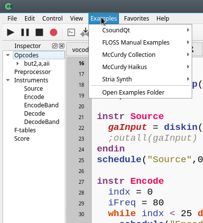
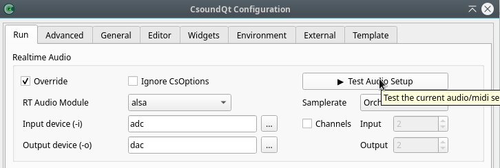
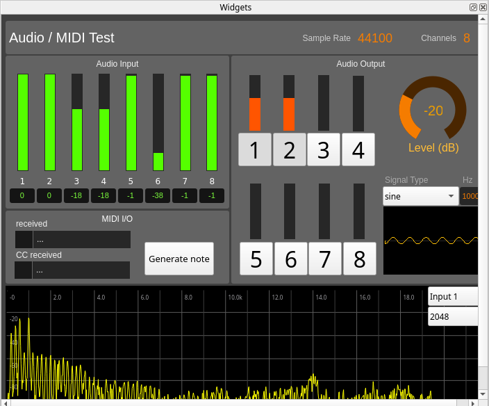
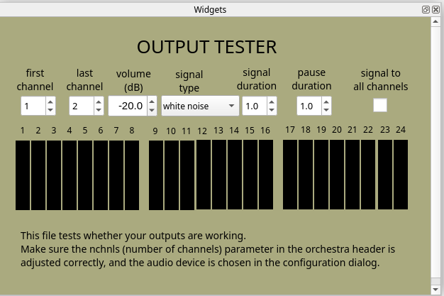
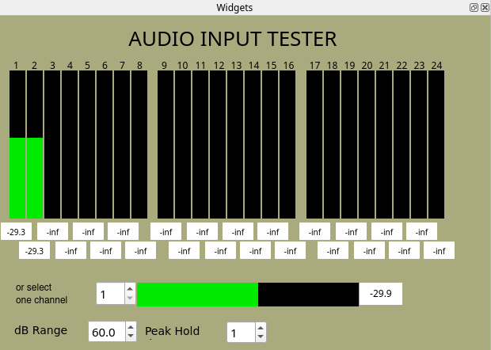
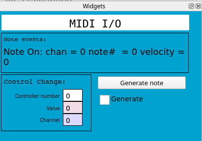
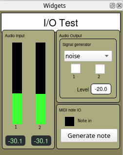

# Examples

CsoundQt offers a rich and diverse example collection in its *Examples* Menu:

## Useful

We want to highlight here some essential examples which are useful to test the audio and MIDI connections. All are in the *Examples > CsoundQt > Useful* directory.

### Audio/Midi test

This is an extended examples to test all functionality. It can also be started via the *Configure* panel:

It somehow replaces three older tests for Audio Output, Audio Input and MIDI test which nevertheless can still be useful because of some features:

### Audio Output Test

### Audio Input Test

### MIDI IO Test

### IO Test

As a simple example for stereo, this is still useful:

### Audio Thru Test

This is useful to test the latency of your audio configuration. (You can adjust the buffer sizes in the [Advanced Tab](config_advanced.md) of CsoundQt's Configuration panel.)

## Other Examples

There are two large example collections included in the example menu:

- [Iain McCurdy's Realtime Examples](http://iainmccurdy.org/csound.html) which was originally created for FLTK widgets and has been translated for CsoundQt by Renè.  
- The examples from the [Csound FLOSS Manual](https://flossmanual.csound.com/).

Enjoy exploring these and many other examples. Feedback and suggestions for improvement are always welcome!