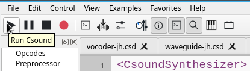

# First Run and Trouble Shooting

After installing Csound and CsoundQt, start CsoundQt. You will see an editor with different tabs.

## Run Example

Navigate to the *Hello World* example in the built-in *Getting Started* tutorial of CsoundQt:

After this file is loaded, push the *Run Csound* button top left:

You should now hear one second of a 440 Hz sine tone.

## Trouble Shooting

But what if not? Some tips here; more later.

- Did you really install Csound first, and then CsoundQt? Otherwise CsoundQt can not call the Csound audio engine.  
- Look at the console. (If it is not visible, go to *View > Output Console*.) Is there any error message which makes sense to you?  
- Open the *Configuration* panel by clicking on the button in the toolbar. Look at the first tab which is called *Run*:

In the *Realtime Audio* section, you should see an audio driver selected. If this field is empty, choose one from the pulldown menu. "Portaudio" should work for all platforms.  
The field *Input device (-i)* should usually be set to *adc* and *Output device (-o)* to *dac* as seen in the picture.  
