# Widgets

CsoundQt offers a set of widgets to create a Graphical User Interface (GUI). Widgets can be used to show what happens in a real-time performance of Csound, or to control the performance itself. If CsoundQt is built with RtMidi, a widget can directly be connected with any MIDI controller.

You will find a built-in documentation of the widget in CsoundQt's Examples > Widgets. It is recommended to read and click it in addition to the description here.


## How to Create a Widget

Open the widget panel (push the "Widgets" button or go to View > Widgets) and right-click in it. You get a submenu:

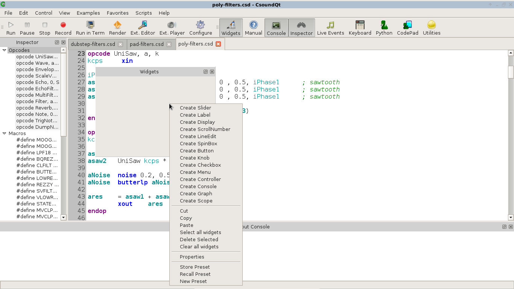

Choose a widget, for instance a SpinBox. You will get a new panel with the properties of the widget:

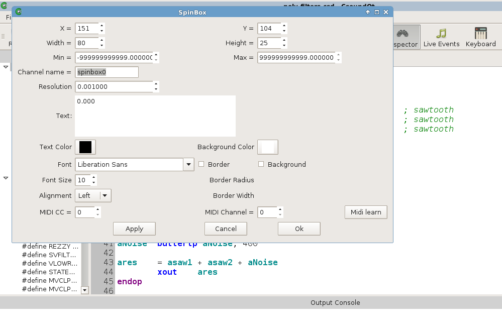

+    **x/y** — absolute position in the panel in pixel  
+    **Width/Height** — size of the widget in pixel  
+    **Min/Max** — minimum/maximum number the widget can return  
+    **Channel name** — a name for the communication between Csound and a widget  
+    **Resolution** — the smallest resolution of the numbers (if set to 1, you will only get integers)  
+    **Text** — the current value (usually set by the user in real-time)  
+    **Text Color / Background Color** — clicking on these buttons opens a dialog for setting colors  


##Edit and Play Mode

Once you clicked OK, you will see the SpinBox in the widget panel. If you want to change the position, go to *Edit > Widget Edit Mode* (or Ctrl+E).


If Edit Mode is on, you can move the widgets or change their size by dragging the right bottom corner. 

Like in [PD](http://puredata.info) or [Max](http://cycling74.com/max), you can toggle all the time between Edit and Play Mode. If you want to change any of the preferences, double-click on a widget in Edit Mode, or right-click on it in Play Mode (and choose *Properties*).

In Play Mode, you can change the widget values by the mouse and/or the computer keyboard. Note that a new value for the SpinBox will only be active when you hit the Return key.


##Get Values from a Widget

Widgets communicate with Csound via a channel name. As shown above, you set the channel name in the widgets properties. Choose a meaningful name:

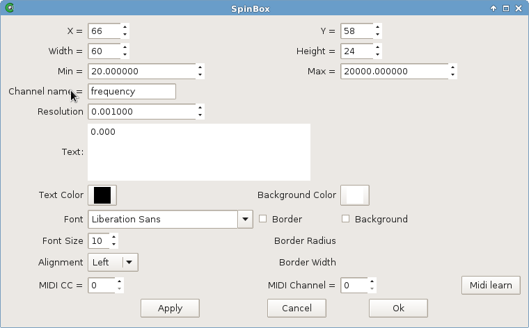
You can receive the values from a widget via two opcodes: `invalue` or `chnget`. If the widget channel is "frequency" (you type it blank but it is a string), the lines of Csound code would be either

    kFreq invalue "frequency"

or

    kFreq chnget "frequency"

Most of the widgets return numbers, but some (LineEdit and Button) can return strings. In this case, the Csound code will be something like this:

    S_file invalue "filename"
    S_file chnget "filename"

Whether you use [invalue](http://csound.github.io/docs/manual/invalue.html) or [chnget](http://csound.github.io/docs/manual/chnget.html), is more or less up to your preferences. Both are slightly different implemented (have a look at the Csound Manual for details). For passing long strings to Csound, `chnget` is currently preferable. Also, the chnget/chnset system is much more efficient for CsoundQt files which use a lot of widgets. Remember to declare the channels in the header of your csd file, for instance:

    chn_S "filename", 3
    chn_k "frequency", 3

In the widget's submenu you will find an item "add chn_k to csd" which does this job for you. This declaration is in particular necessary if you want to receive the current values of the widgets on startup.

The k-Variables in Csound, which get the numbers of any widget, will usually be smoothed, to avoid jumps or sudden transitions (in particular for amplitudes). This can be done easily with the `port` opcode. This is a typical code:

    kDb invalue "db" ;receive dB value from a widget
    kDb port kDb, .1 ;smoothes the transitions
    out aSound * ampdb(kDb) ;applies as volume


## Reserved Channels

There are some channels which carry some particular functionality. They all start with the underscore character. The first four are for Control/Transport (and usually have no receiver in the Csound code), whereas *_Browse* and *_MBrowse* will pass a string to Csound.

+   **_Play** — If the value of this channel is 1, CsoundQt will play the current csd file (similar to pressing the *Run* button).  
+   **_Pause** — If the value of this channel is 1, CsoundQt will pause/resume the performance (= *Pause* button).  
+   **_Stop** — If the value of this channel is 1, CsoundQt will terminate the performance (= *Stop* button).  
+   **_Render** — If the value of this channel is 1, CsoundQt will render the current csd to an audio file (= *Render* button).

+   **_Browse** — Use a button widget in the *value* mode. When a button is set to this channel, clicking on it (in Play Mode) will open a *Select File* dialog. You can choose here any file, and it will be saved in a string variable. You can also use this channel more than once by adding anything; for instance **_Browse1** and **_Browse2** will store two different file names.  
+   **_MBrowse** — The behaviour is similar to *_Browse*, but you can select here more than one file. Ths paths will be seperated by a | character. The following lines of Csound code show a possible result:  

```
    chn_S "_MBrowse", 2 ;declares channel for input
    instr Receive_Filenames
        S_files chnget "_MBrowse"
        puts S_files, 1
    endin
    -> /home/jh/Desktop/7chnls.aiff|/home/jh/Desktop/abend1.wav|/home/jh/Desktop/BratscheStereo.aiff|/home/jh/Desktop/chirp40-1300Hz.wav
```

## Presets

A preset is another reserved channel. Its goal is to store and recall a widget snapshot. The most simple and intuitive way to store and recall presets is to right-click in the widget panel, and the choose *Store Widget*. There is also a build-in example: Examples > Widgets > Presets.


## Pass Values to a Widget

Widgets can also be used to show values which are changing in Csound, as visual feedback for the user or performer. Any k-variable can be shown by many widgets, like sliders, displays or spin boxes. Just set the widget channel to any useful name, and insert either `outvalue` or `chnset` in the Csound code, for instance:

    kDb randomi -30, -10, 1/2, 3
    outvalue "db", kDb
    chnset kDb, "db"


## Widget Types Overview
This is a short description, followed by a screenshot from the buildin widget examples.

### Slider
The standard widget, well known in all Audio GUIs. It can be either vertical or horizontal.  
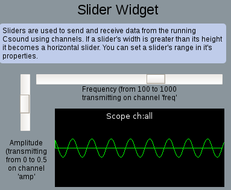

### Label
A textbox for comments or similar.  
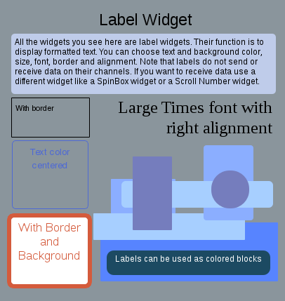

### Display
Can display any value from Csound (numbers or strings).  
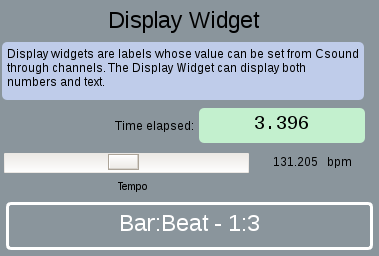

### ScrollNumber
Number box whichs values are changed by mouse scrolling.  


### LineEdit
A text field which can be used either for user input (passed to Csound as a string), or display any string (for instance a file name which is received by the _Browse reserved channel).  
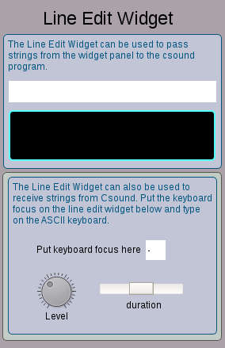

### SpinBox
A number box either for user input (via type/return or the scroll bar), or to show any Csound k-value.  


### Button
A button can either fire an event (trigger an instrument or create a function table), or pass a value when pushed. A *latch* option transforms a button to a toggle.  
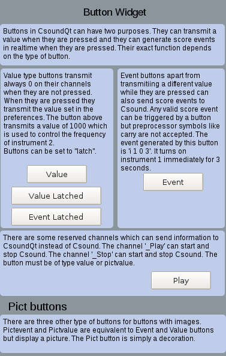

### Knob
Similar functionality as slider, just different design.  
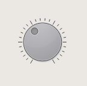

### Checkbox
Sends 1/0 if checked/unchecked. So the behaviour is actually the same as a button in latch mode.  
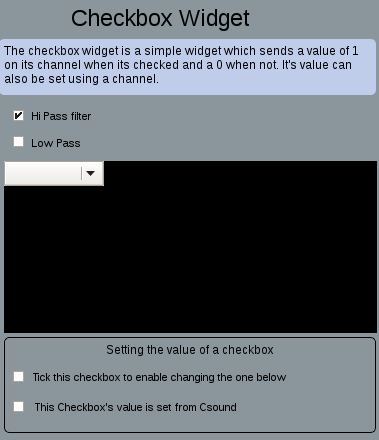

### Menu
Shows names, but returns numbers (starting from zero) for the different items.  


### Controller
A widget with many possibilities. Can be used as x/y pad, or as slider, or as signal display.  
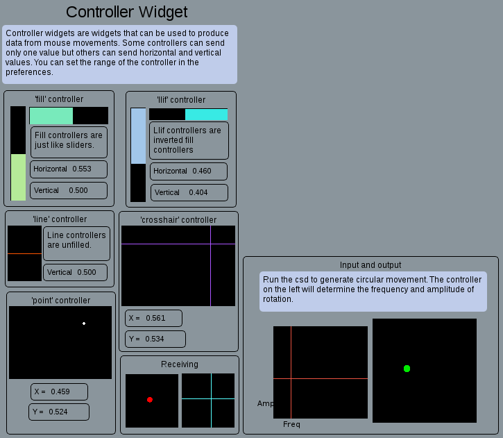

### Console
Displays the output of the Csound console in a widget.  


### Graph
Displays Csound's function tables, and FFT analysis, too.  
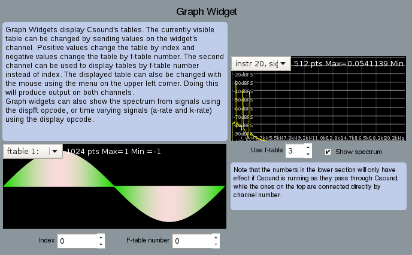

### Scope
Displays Csound's audio output, and some more ...  
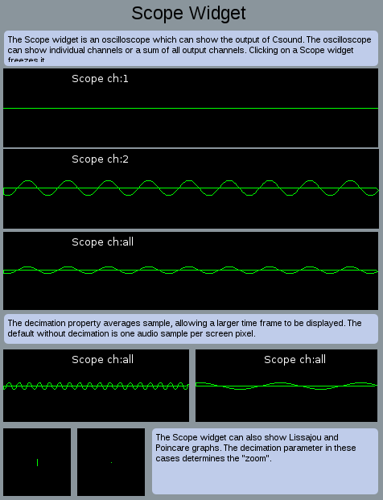

### Virtual Keyboard
This widget is not under the *Create Widget* submenu, as it is not part of the widget panel. It is created by pushing the *Keyboard* button, and pops up as independent panel. It can substitute an external MIDI keyboard.  
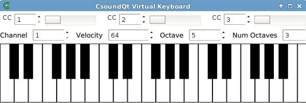

## MIDI Integration
If your CsoundQt has been compiled with RtMidi support, you can assign any MIDI controller directly to any widget. Just open the properties and type in MIDI channel and Controller Number, or use the MIDI Learn functionality.  
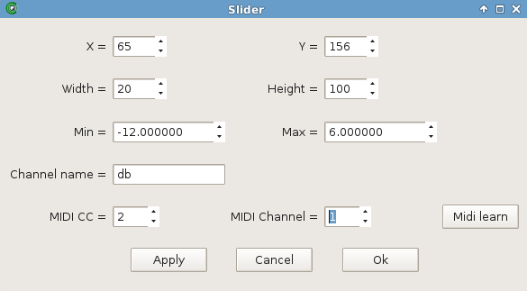

