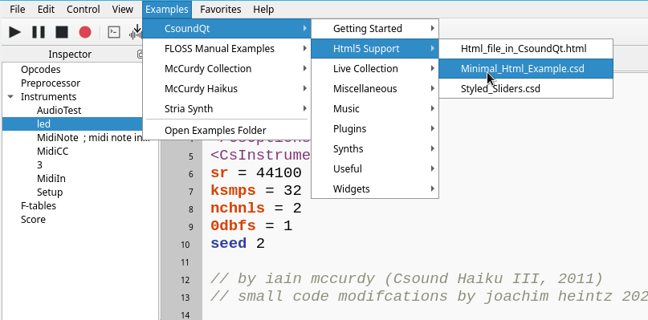

# HTML5 Support

It is possible to use any html5 code inside your CSD file in CsoundQt. This code must be enclosed in a tag called *html*.

Have a look at the *Minimal html5 example* to see how it works:

